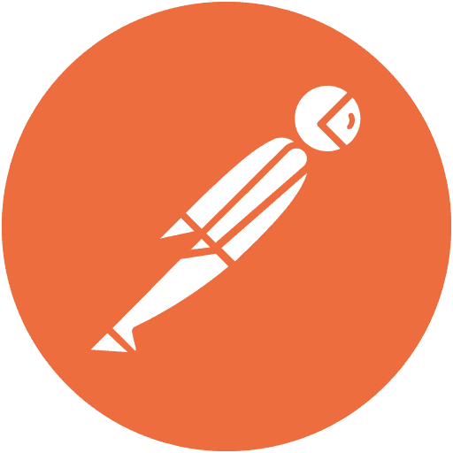

## Hi 👋

My name is Karol, I am a student at the Łódź University of Technology. I am interested in web development, in particular the Back-end. I have the most experience using Python with Flask or Django on the Back-end side. I am also interested in creating computer games, mostly with Unreal Engine or Unity and WordPress theme development.

## Languages: 

	
	
	
	
	

## Frameworks: 

	
	
	
	

## Tools: 

	
	
	
	
	
	
	
	
	
	
	
	
	

 
## Stats: 

	

	

